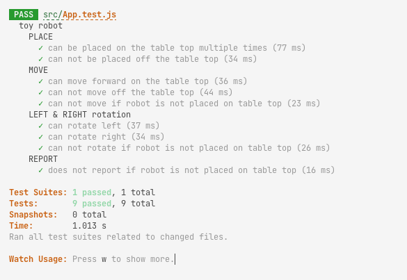

# Toy Robot Code Challenge

## <b>[Visit the live app](https://didley-toy-robot.netlify.app)</b>

### Available Scripts

In the project directory, you can run:

#### `yarn install`

Sets up project and installs dependencies
#### `yarn start`

Runs the app in the development mode.\

#### `yarn test`

Launches the test runner in the interactive watch mode.\

